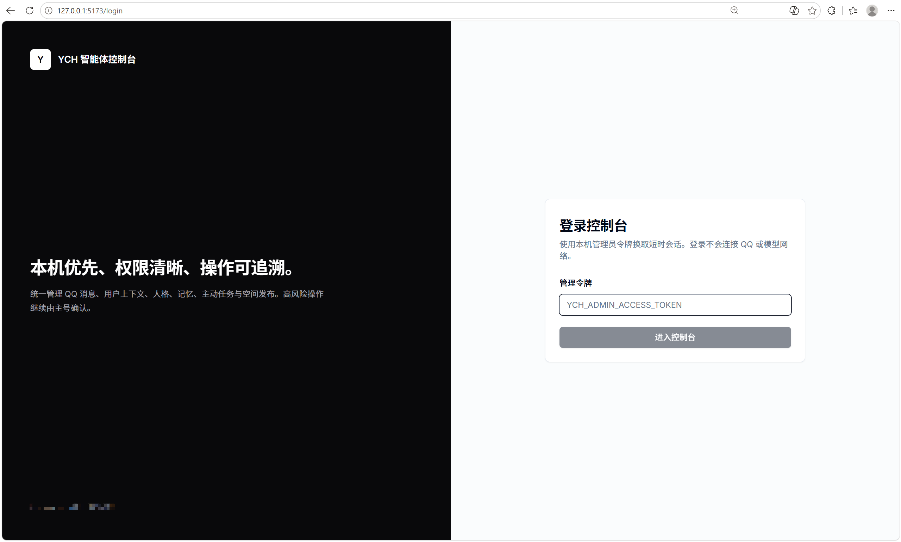
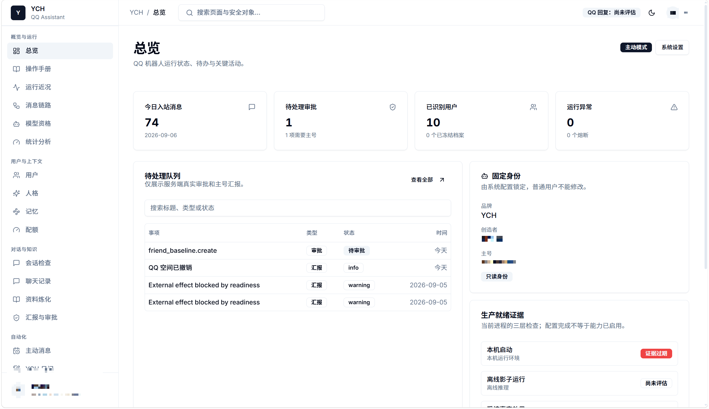
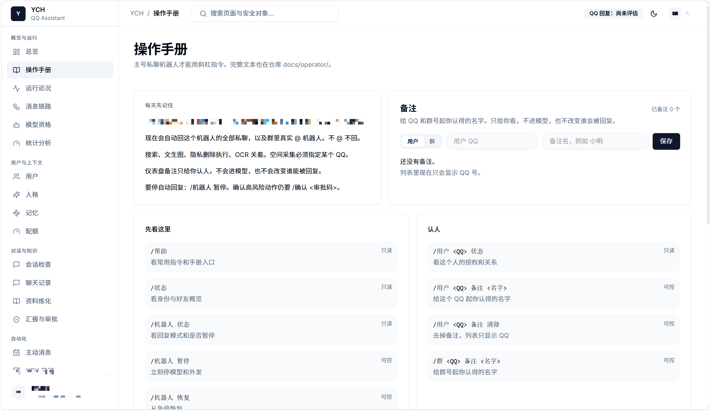
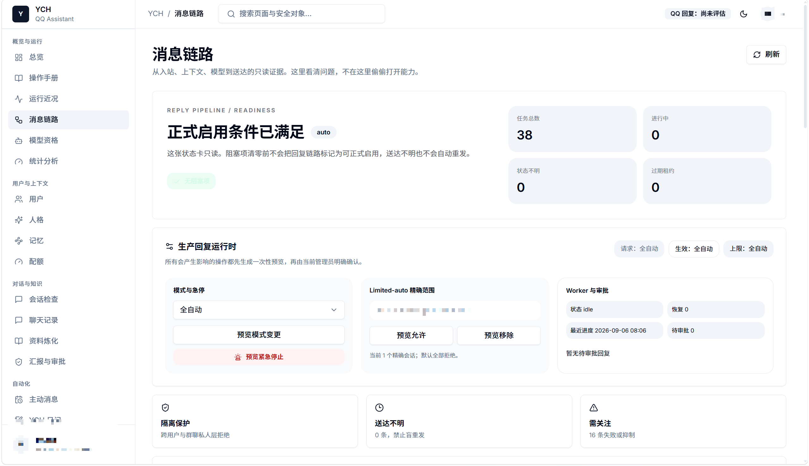
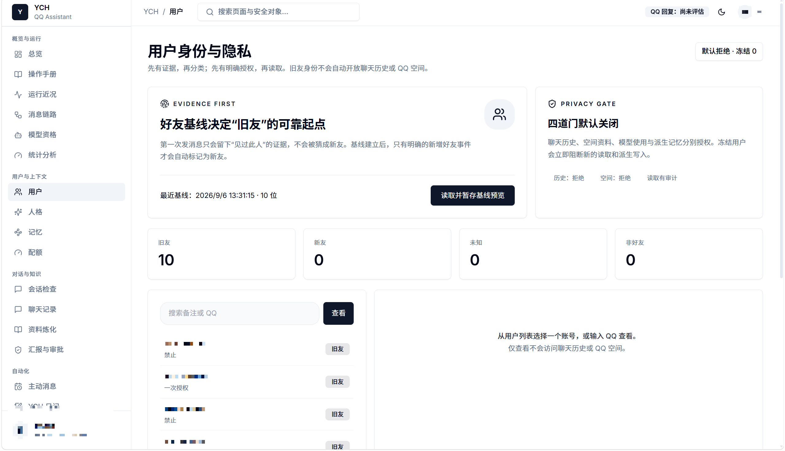
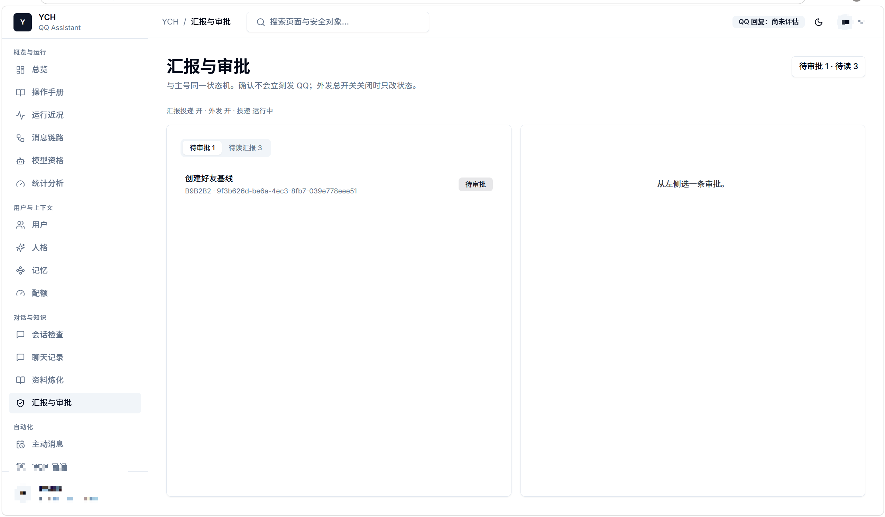
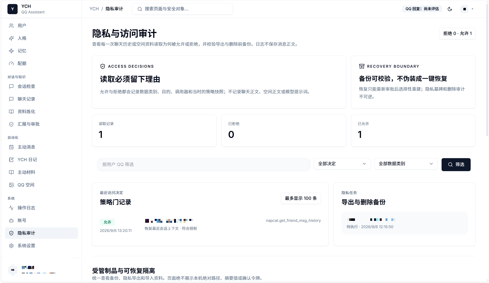

# YCH Bot

基于 **NapCat / OneBot** 的本机 QQ 助手。优先跑在你自己的电脑上：权限默认关闭，高风险操作要主号确认，仪表盘把运行状态摊开给你看。

> 这是公开模板。品牌是 **YCH**，创造者显示名为 **维护者**。截图里的姓名和 QQ 已打码；仓库里的示例 QQ 是占位符，不是真实账号。



## 它能做什么

| 能力 | 说明 |
| --- | --- |
| 消息入库与回复链路 | 入站可观察，回复有明确模式（观察 / 影子 / 审批 / 自动），可急停 |
| 用户与隐私 | 好友基线、历史/空间授权、冻结；默认拒绝读取 |
| 人格与记忆 | 按用户隔离；群聊不带私人人格/记忆 |
| 主动消息与日记 | 可调度、可审批，安静时段与限频 |
| QQ 空间 | 草稿 / 审批 / 发布任务；资料采集需显式授权 |
| 模型资格 | 仪表盘预览确认后再跑鉴定；通过 ≠ 打开生产外发 |
| 操作手册与备注 | 主号指令集中查看；给 QQ/群号起只给操作者看的备注 |

## 仪表盘一览

登录只用本机管理令牌换短时会话，**不会**因此去连 QQ 或模型网络。

### 总览

今日入站、待审批、已识别用户、异常，以及固定身份与就绪证据。



### 操作手册

主号私聊 `/` 指令、每天要注意的边界，以及用户/群备注。



### 消息链路

从入站到模型再到外发的任务与运行时控制：模式、急停、隔离与失败关注。



### 用户身份与隐私

证据优先、四道门默认关；先授权再读取，查看本身不会翻聊天或空间。



### 汇报与审批

高风险动作走预览 / 确认；待办和主号汇报集中处理。



### 系统

连接、配置事实与生产就绪分层展示——「配好了」不等于「已经在对外发」。



更多页面截图（人格、记忆、配额、会话检查、聊天记录、资料炼化、主动消息、日记、空间、隐私、制品、运维等）在 [`docs/screenshots/`](docs/screenshots/)。

## 安全默认

- 外发 QQ、模型网络、空间发布、隐私任务执行、搜索、文生图、OCR：**默认关**
- 就绪检查通过只是必要条件，不能代替授权、额度、审批、急停和能力门
- 密钥只写本机 `.env`，不要提交

## 快速开始

```powershell
uv sync --extra dev
Copy-Item .env.example .env
# 填写你自己的 QQ、令牌和模型配置
uv run ych-bot
```

仪表盘：

```powershell
npm --prefix frontend install
npm --prefix frontend run dev
```

观察模式一键启动（先起 YCH，再拉 NapCat，不打开外发）：

```powershell
.\scripts\start-observe.bat
```

## 仓库结构

```text
backend/           Python 后端与分层测试
frontend/          操作仪表盘
openspec/specs/    当前行为规格
scripts/           启动与提交闸门
docs/screenshots/  已打码的界面截图
.env.example       可提交的空配置样例
```

完整交接文档、阶段历史、OpenSpec 变更归档等只留在维护者本机私有仓，不在此公开仓库。
